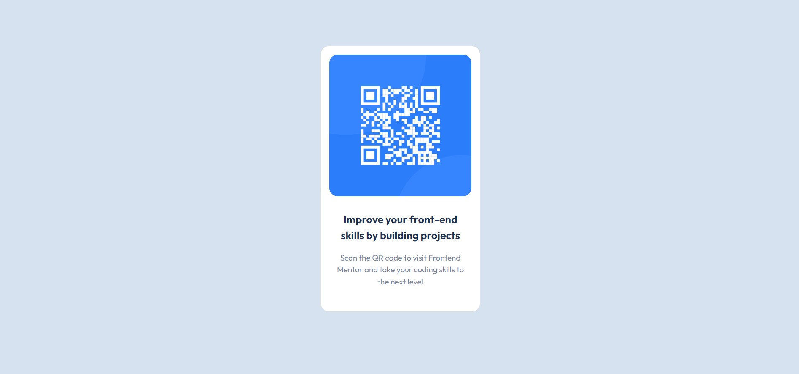

# Frontend Mentor - QR code component solution

This is a solution to the [QR code component challenge on Frontend Mentor](https://www.frontendmentor.io/challenges/qr-code-component-iux_sIO_H). 

## Table of contents

- [Overview](#overview)
  - [Screenshot](#screenshot)
  - [Links](#links)
- [My process](#my-process)
  - [Built with](#built-with)
  - [What I learned](#what-i-learned)
  - [Continued development](#continued-development)
- [Author](#author)


## Overview

### Screenshot




### Links

- Live Site URL: [QR Code](https://qrcodefro.netlify.app/)

## My process

### Built with

- Semantic HTML5 markup
- CSS custom properties
- [Bootstrap](https://getbootstrap.com/) - Frontend Library


### What I learned

- Used it to revise my lessons on css3 and html5.
- Got a chance to put one of the Bootstrap component called card in action.
- Learned to make use of media query breakpoints

 ```css
@media screen and (max-width: 375px) {
    .card{
        width:82%;
    }
}
```


### Continued development

- Require further study on responsive design


## Author

- Website - Pratyush
- Frontend Mentor - [@pratyushd0308](https://www.frontendmentor.io/profile/pratyushd0308)
